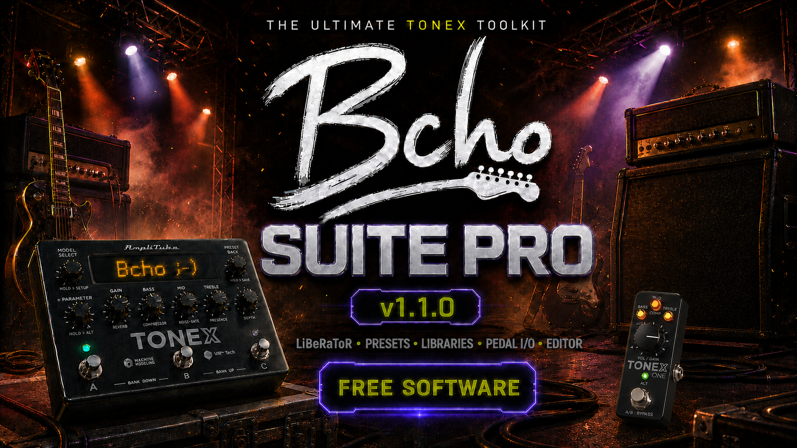

> ⚠️ **Use at your own responsibility.** BCho makes these tools available for you to use at your own responsibility. You should only use them on collections you are licensed to own.
>
> ⚠️ **Uso bajo tu responsabilidad.** BCho pone estas herramientas a tu disposición para que las utilices bajo tu propia responsabilidad. Deberías usarlas únicamente sobre colecciones de las que poseas la licencia.

# Bcho Suite Pro

## English

**Bcho Suite Pro** is a free desktop application for musicians who work with IK Multimedia TONEX. It brings together a set of practical tools for handling presets, TONEX libraries and compatible TONEX pedals from one place.

With the Suite you can manage and organize your TONEX content, export and prepare presets, create or merge libraries, import collections, make backups of compatible pedals and edit presets with a clear multilingual interface.

The application includes a complete manual in several languages.

Version 1.1.0 adds selected pedal-slot export with or without BCho, creation of new `Library.db` files from pedal slots, improved backup and restore workflows, better selection and progress feedback, and manual update checking from Settings.

**Download the latest version:**
[Windows](https://bcho-downloads.bcho.workers.dev/dl/latest/windows) ·
[Linux](https://bcho-downloads.bcho.workers.dev/dl/latest/linux) ·
[macOS (Apple Silicon)](https://bcho-downloads.bcho.workers.dev/dl/latest/macos-apple) ·
[macOS (Intel)](https://bcho-downloads.bcho.workers.dev/dl/latest/macos-intel)

Or browse all versions and release notes on [GitHub Releases](https://github.com/bchosoft/BSP/releases/latest).

## Español

**Bcho Suite Pro** es una aplicación gratuita de escritorio para músicos que trabajan con IK Multimedia TONEX. Reúne en un solo lugar varias herramientas prácticas para manejar presets, bibliotecas de TONEX y pedales TONEX compatibles.

Con la Suite puedes gestionar y organizar tu contenido de TONEX, exportar y preparar presets, crear o fusionar bibliotecas, importar colecciones, hacer copias de seguridad de pedales compatibles y editar presets desde una interfaz clara y multilingüe.

La aplicación incluye un manual completo en varios idiomas.

**Descarga la última versión:**
[Windows](https://bcho-downloads.bcho.workers.dev/dl/latest/windows) ·
[Linux](https://bcho-downloads.bcho.workers.dev/dl/latest/linux) ·
[macOS (Apple Silicon)](https://bcho-downloads.bcho.workers.dev/dl/latest/macos-apple) ·
[macOS (Intel)](https://bcho-downloads.bcho.workers.dev/dl/latest/macos-intel)

O consulta todas las versiones y notas de la release en [GitHub Releases](https://github.com/bchosoft/BSP/releases/latest).

La versión 1.1.0 añade la exportación de slots seleccionados del pedal con o sin BCho, la creación de nuevas `Library.db` desde slots del pedal, mejoras en backups y restauraciones, mejores indicadores de selección y progreso, y la búsqueda manual de actualizaciones desde Ajustes.
