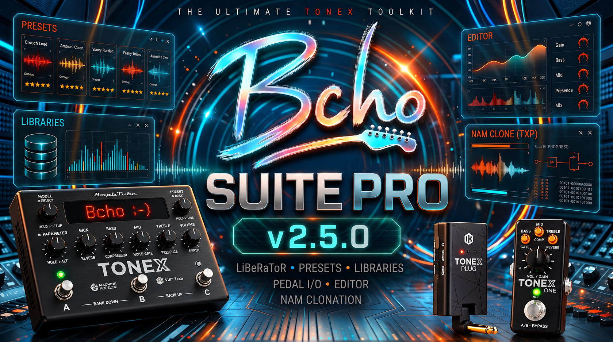

> ⚠️ **Use at your own responsibility.** BCho makes these tools available for you to use at your own responsibility. You should only use them on collections you are licensed to own.
>
> ⚠️ **Uso bajo tu responsabilidad.** BCho pone estas herramientas a tu disposición para que las utilices bajo tu propia responsabilidad. Deberías usarlas únicamente sobre colecciones de las que poseas la licencia.

# Bcho Suite Pro

## English

**Bcho Suite Pro** is a desktop application for musicians who work with IK Multimedia TONEX. Its core tools are free; NAM → TONEX uses an integrated native engine on Windows, macOS and Linux and includes three free clones before separate registration. It brings together tools for handling presets, TONEX libraries and compatible TONEX pedals from one place.

With the Suite you can manage and organize your TONEX content, export and prepare presets, create or merge libraries, import collections, make backups of compatible pedals and edit presets with a clear multilingual interface.

The application includes illustrated user manuals in Spanish, English, Galician, Catalan, Basque, Portuguese, Italian, French, German and Russian.

Version 2.5.0 adds full support for classic and TONEX 2.0 libraries (`Library2.db` plus its `Library` content folder), including import, repair, extraction, conversion, merging, ZIP packaging, User Folder preservation and organized disk exports. Its USB tools recognize TONEX Pedal, TONEX Plug, TONEX One and TONEX ONE+. TONEX ONE+ support is still being tested, so the app warns before reading it; unknown devices are not read or modified.

Version 1.1.6 fixes an issue when importing folders into a new or existing `Library.db` where presets were saved with an outdated format version. TONEX could consequently display default or incorrect effects in the preset editor and overwrite the correct effects when closing it. Imported presets now use the current format version and preserve their effects correctly. This issue was resolved thanks to a user who identified and reported it, and we greatly appreciate their feedback.

Version 1.1.5 adds fully bidirectional TONEX Pedal editing: physical preset, parameter and save changes are reflected in the app, while USB Pedal I/O and the editor share a cached slot list without unnecessary full rereads. It also adds safe unsaved-change handling, saved-vs-current comparison, Live revert, temporary recovery presets, automatic USB reconnection, detailed connection states, modified-preset badges, activity history and integrated diagnostics. TONEX Pedal slots now match the hardware numbering, 0–149.

**Download the latest version:**
[Windows](https://bcho-downloads.bcho.workers.dev/dl/v2.5.0/windows) ·
[Linux](https://bcho-downloads.bcho.workers.dev/dl/v2.5.0/linux) ·
[macOS (Apple Silicon)](https://bcho-downloads.bcho.workers.dev/dl/v2.5.0/macos-apple) ·
[macOS (Intel)](https://bcho-downloads.bcho.workers.dev/dl/v2.5.0/macos-intel)

Or browse all versions and release notes on [GitHub Releases](https://github.com/bchosoft/BSP/releases/latest).

## Español

**Bcho Suite Pro** es una aplicación de escritorio para músicos que trabajan con IK Multimedia TONEX. Sus herramientas principales son gratuitas; NAM → TONEX utiliza un motor nativo integrado en Windows, macOS y Linux y permite tres clonados gratuitos antes de su registro independiente. Reúne herramientas para manejar presets, bibliotecas de TONEX y pedales TONEX compatibles.

Con la Suite puedes gestionar y organizar tu contenido de TONEX, exportar y preparar presets, crear o fusionar bibliotecas, importar colecciones, hacer copias de seguridad de pedales compatibles y editar presets desde una interfaz clara y multilingüe.

La aplicación incluye manuales de usuario ilustrados en español, inglés, gallego, catalán, euskera, portugués, italiano, francés, alemán y ruso.

La versión 2.5.0 añade compatibilidad completa con bibliotecas clásicas y TONEX 2.0 (`Library2.db` y su carpeta de contenido `Library`), incluyendo importación, reparación, extracción, conversión, fusión, empaquetado ZIP, conservación de User Folders y exportaciones en disco organizadas. Sus herramientas USB reconocen TONEX Pedal, TONEX Plug, TONEX One y TONEX ONE+. La compatibilidad con TONEX ONE+ sigue en pruebas, por lo que la app avisa antes de leerlo; los dispositivos desconocidos no se leen ni modifican.

La versión 1.1.6 corrige un problema al importar carpetas en una `Library.db` nueva o existente que guardaba los presets con una versión de formato obsoleta. Esto podía hacer que TONEX mostrase efectos predeterminados o incorrectos en el editor del preset y sobrescribiese los efectos correctos al cerrarlo. Los presets importados ahora utilizan la versión de formato actual y conservan correctamente sus efectos. Este problema ha sido solucionado gracias a su detección por parte de un usuario, al que agradecemos enormemente sus comentarios.

**Descarga la última versión:**
[Windows](https://bcho-downloads.bcho.workers.dev/dl/v2.5.0/windows) ·
[Linux](https://bcho-downloads.bcho.workers.dev/dl/v2.5.0/linux) ·
[macOS (Apple Silicon)](https://bcho-downloads.bcho.workers.dev/dl/v2.5.0/macos-apple) ·
[macOS (Intel)](https://bcho-downloads.bcho.workers.dev/dl/v2.5.0/macos-intel)

O consulta todas las versiones y notas de la release en [GitHub Releases](https://github.com/bchosoft/BSP/releases/latest).

La versión 1.1.5 añade edición completamente bidireccional del TONEX Pedal: los cambios físicos de preset, parámetros y guardado se reflejan en la app, mientras USB Pedal I/O y el editor comparten la lista de slots sin relecturas completas innecesarias. También incorpora protección ante cambios sin guardar, comparación guardado-actual, reversión Live, presets temporales de recuperación, reconexión USB automática, estados de conexión detallados, distintivos de preset modificado, historial de actividad y diagnóstico integrado. La numeración del TONEX Pedal coincide ahora con el hardware: 0–149.
